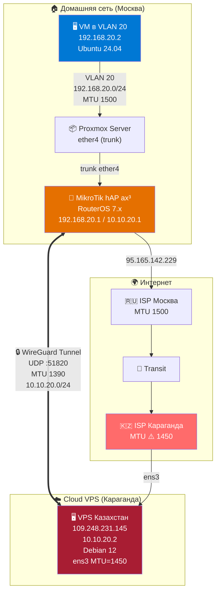
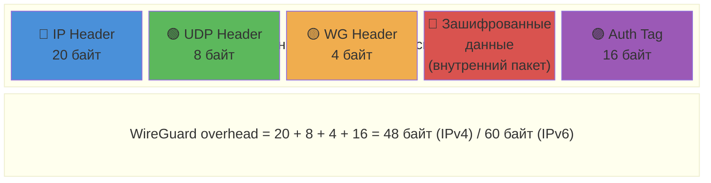
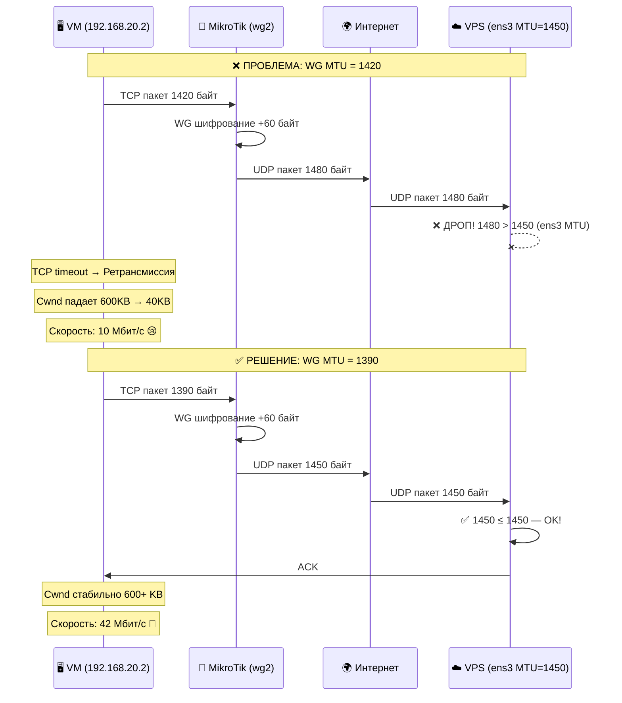
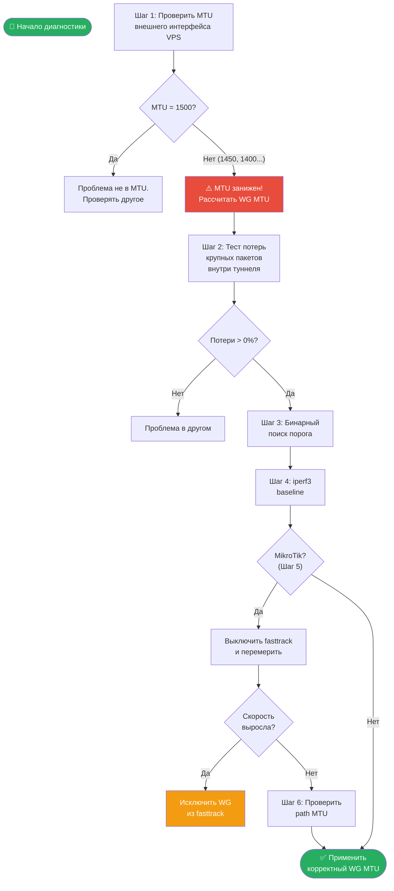
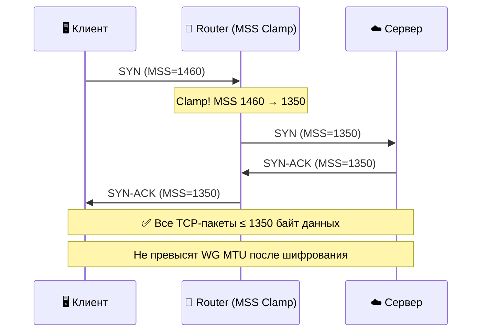

<p align="center">
  
</p>

<h1 align="center">🔧 WireGuard MTU Black Hole — Диагностика и решение</h1>

<p align="center">
  <strong>Пошаговое руководство по диагностике и устранению проблем со скоростью WireGuard,<br>вызванных несоответствием MTU на облачных VPS</strong>
</p>

<p align="center">
  
  
  
  
  
</p>

<p align="center">
  <a href="#-симптомы">Симптомы</a> •
  <a href="#-теория">Теория</a> •
  <a href="#-диагностика">Диагностика</a> •
  <a href="#-решение">Решение</a> •
  <a href="#-результат">Результат</a>
</p>

---

## 📋 Оглавление

- [Описание проблемы](#-описание-проблемы)
- [Симптомы](#-симптомы)
- [Топология сети](#-топология-сети)
- [Теория: как MTU ломает WireGuard](#-теория-как-mtu-ломает-wireguard)
- [Диагностика: пошаговый алгоритм](#-диагностика-пошаговый-алгоритм)
  - [Шаг 1 — Определить MTU внешнего интерфейса VPS](#шаг-1--определить-mtu-внешнего-интерфейса-vps)
  - [Шаг 2 — Тест потерь крупных пакетов внутри туннеля](#шаг-2--тест-потерь-крупных-пакетов-внутри-туннеля)
  - [Шаг 3 — Бинарный поиск порога потерь](#шаг-3--бинарный-поиск-порога-потерь)
  - [Шаг 4 — Замер baseline скорости (iperf3)](#шаг-4--замер-baseline-скорости-iperf3)
  - [Шаг 5 — Исключить fasttrack (MikroTik)](#шаг-5--исключить-fasttrack-mikrotik)
  - [Шаг 6 — Проверить path MTU внешнего канала](#шаг-6--проверить-path-mtu-внешнего-канала)
- [Решение](#-решение)
  - [Формула расчёта MTU](#формула-расчёта-mtu)
  - [Применение фикса](#применение-фикса)
- [Результат](#-результат)
- [MSS Clamping — зачем и как](#-mss-clamping--зачем-и-как)
- [Частые значения MTU у провайдеров](#-частые-значения-mtu-у-провайдеров)
- [Чек-лист при развёртывании нового WG-туннеля](#-чек-лист-при-развёртывании-нового-wg-туннеля)

---

## 📝 Описание проблемы

При настройке WireGuard-туннеля между домашним MikroTik-роутером и облачным VPS скорость через туннель составляла **~10 Мбит/с** при прямой скорости канала **~110 Мбит/с**. Большие ICMP-пакеты (≥1350 байт) через туннель терялись. TCP-соединения страдали от массовых ретрансмиссий.

**Причина:** облачный VPS имел MTU внешнего интерфейса **1450** (вместо стандартных 1500) из-за overlay-сети провайдера (VXLAN/GRE). При стандартном WireGuard MTU 1420 зашифрованные пакеты превышали 1450 байт и дропались.

---

## 🚨 Симптомы

Если вы наблюдаете **любой** из этих признаков — велика вероятность MTU-проблемы:

| Симптом | Описание |
|---------|----------|
| 🐌 **Низкая скорость** | Скорость через туннель в 5–15 раз ниже прямого канала |
| 📦 **Потери крупных пакетов** | `ping -s 1400 <peer>` — 100% потерь, а `ping -s 500 <peer>` — 0% |
| 🔄 **TCP ретрансмиссии** | iperf3 показывает сотни Retr, Cwnd падает до 30–50 KB |
| 📉 **Деградация скорости** | Скорость начинается нормально, затем падает в течение секунд |
| 🔇 **Пинги без DF дропаются** | Даже `ping -s 1372 <peer>` (без флага DF) — 100% потерь |
| 🌊 **Нестабильные потери** | Пакеты ~1350 байт — 100% потерь, ~1370 — 20% (не чёткий порог) |

---

## 🌐 Топология сети



---

## 📖 Теория: как MTU ломает WireGuard

### Что такое MTU

**MTU (Maximum Transmission Unit)** — максимальный размер пакета, который может пройти через сетевой интерфейс без фрагментации.

### Структура WireGuard-пакета



> ⚠️ Также WireGuard добавляет **padding** — выравнивание до 16 байт. Реальный overhead может быть **48–64 байт** для IPv4.

### Что происходит при MTU mismatch



### Почему Path MTU Discovery не спасает

В идеальном мире PMTUD решил бы проблему автоматически: маршрутизатор с меньшим MTU отправляет ICMP "Fragmentation Needed" отправителю, и тот снижает размер пакетов.

Но на практике:
- Многие провайдеры **блокируют ICMP**
- Файрволы на VPS (UFW/iptables) могут **фильтровать** ICMP-ответы
- Отправитель не узнаёт о проблеме → повторяет отправку тем же размером → дроп → ретрансмиссия

---

## 🔍 Диагностика: пошаговый алгоритм



### Шаг 1 — Определить MTU внешнего интерфейса VPS

**На VPS:**

```bash
ip link show | grep mtu
```

Пример вывода:
```
2: ens3: <BROADCAST,MULTICAST,UP,LOWER_UP> mtu 1450 qdisc fq_codel state UP
```

> ⚠️ Если MTU **меньше 1500** — это типично для облачных провайдеров (Hetzner Cloud, AWS, GCP, Yandex Cloud, VK Cloud, DigitalOcean и др.), использующих overlay-сети (VXLAN, GRE, Geneve).

Также можно проверить явно:

```bash
# Попытка отправить пакет 1500 байт с DF-флагом
ping -c 3 -s 1472 -M do <REMOTE_HOST>
```

Если вы видите `local error: message too long, mtu=1450` — MTU интерфейса = 1450.

### Шаг 2 — Тест потерь крупных пакетов внутри туннеля

Пинг с одного конца WG-туннеля на другой разными размерами:

```bash
# С VPS → MikroTik (или наоборот) через туннельные IP
ping -c 5 -s 56   10.10.20.1   # маленький — контрольный
ping -c 5 -s 1300 10.10.20.1   # средний
ping -c 5 -s 1400 10.10.20.1   # большой — скорее всего потери
```

**Интерпретация:**

| Маленькие | Большие | Вердикт |
|-----------|---------|---------|
| ✅ 0% | ✅ 0% | MTU OK |
| ✅ 0% | ❌ потери | MTU проблема |
| ❌ потери | ❌ потери | Проблема канала, не MTU |

### Шаг 3 — Бинарный поиск порога потерь

```bash
for s in 1300 1320 1340 1350 1360 1370 1380 1390; do
  echo "=== SIZE $s ==="
  ping -c 5 -s $s 10.10.20.1
done
```

Найдите размер, начиная с которого появляются потери. Этот размер + 28 (IP + ICMP headers) = максимальный пакет внутри туннеля.

### Шаг 4 — Замер baseline скорости (iperf3)

**На VPS** (сервер):
```bash
iperf3 -s
```

**С клиента** (VM или другой хост за туннелем):
```bash
iperf3 -c <VPS_TUNNEL_IP> -t 10
```

Ключевые метрики для оценки:
- **Bitrate** — текущая скорость
- **Retr** — количество TCP-ретрансмиссий (должно быть 0 в идеале)
- **Cwnd** — размер окна перегрузки (стабильный = хорошо, падающий = потери)

### Шаг 5 — Исключить fasttrack (MikroTik)

> 📌 Только для MikroTik RouterOS. Fasttrack с `hw-offload=yes` обходит mangle-правила (MSS clamp), что может усугублять проблему.

```routeros
# Временно отключить
/ip firewall filter set [find comment="defconf: fasttrack"] disabled=yes

# Перемерить iperf3 с клиента
# ... (см. Шаг 4)

# Вернуть обратно
/ip firewall filter set [find comment="defconf: fasttrack"] disabled=no
```

**Если скорость выросла в разы** — fasttrack мешает, нужно исключить WG-трафик:

```routeros
# Добавить правила ПЕРЕД fasttrack
/ip firewall filter add chain=forward action=accept \
    connection-state=established,related in-interface=wg2 \
    place-before=[find comment="defconf: fasttrack"]
/ip firewall filter add chain=forward action=accept \
    connection-state=established,related out-interface=wg2 \
    place-before=[find comment="defconf: fasttrack"]
```

**Если скорость не изменилась** — fasttrack не виноват, проблема в MTU.

### Шаг 6 — Проверить path MTU внешнего канала

```bash
# С VPS на удалённый хост с DF-флагом
ping -c 5 -s 1472 -M do <REMOTE_PUBLIC_IP>   # 1500 - 28
ping -c 5 -s 1422 -M do <REMOTE_PUBLIC_IP>   # 1450 - 28
ping -c 5 -s 1372 -M do <REMOTE_PUBLIC_IP>   # 1400 - 28
```

Результаты:
- `message too long, mtu=XXXX` → MTU интерфейса
- `Frag needed` → промежуточный узел с меньшим MTU
- Пакет прошёл → этот размер допустим

---

## ✅ Решение

### Формула расчёта MTU

```
┌──────────────────────────────────────────────────────────────────┐
│                                                                  │
│   WG_MTU = MIN_PATH_MTU − WG_OVERHEAD                           │
│                                                                  │
│   где:                                                           │
│     MIN_PATH_MTU  = минимальный MTU на внешнем пути              │
│     WG_OVERHEAD   = 60 байт (IPv4) или 80 байт (IPv6)           │
│                                                                  │
│   ────────────────────────────────────────────────────────────   │
│                                                                  │
│   Примеры:                                                       │
│     MTU 1500 → WG_MTU = 1500 - 60 = 1440                        │
│     MTU 1450 → WG_MTU = 1450 - 60 = 1390  ← облачные VPS       │
│     MTU 1400 → WG_MTU = 1400 - 60 = 1340                        │
│                                                                  │
└──────────────────────────────────────────────────────────────────┘
```

> 💡 **WireGuard IPv4 overhead (60 байт):** 20 (внешний IP) + 8 (UDP) + 4 (WG header) + 16 (Auth Tag) + 0–15 (padding до 16 байт). Рекомендуется закладывать 60 байт.

### Применение фикса

#### Linux (wg-quick)

```bash
# Редактировать конфиг
mcedit /etc/wireguard/wg0.conf
```

Изменить строку MTU:
```ini
[Interface]
PrivateKey = <key>
Address = 10.10.20.2/24
MTU = 1390    # ← было 1420, стало 1390
```

Применить:
```bash
wg-quick down wg0 && wg-quick up wg0
```

Проверить:
```bash
ip link show wg0 | grep mtu
# wg0: <POINTOPOINT,NOARP,UP,LOWER_UP> mtu 1390
```

#### MikroTik RouterOS

```routeros
/interface wireguard set [find name=wg2] mtu=1390
```

Проверить:
```routeros
/interface wireguard print where name=wg2
```

#### Другие Linux (без wg-quick)

```bash
ip link set wg0 mtu 1390
```

Для постоянного применения — добавить в systemd-unit или `/etc/network/interfaces`.

---

## 📊 Результат

### До и после

```mermaid
xychart-beta
    title "Скорость через WireGuard-туннель (iperf3, Мбит/с)"
    x-axis ["1с", "2с", "3с", "4с", "5с", "6с", "7с", "8с", "9с", "10с"]
    y-axis "Мбит/с" 0 --> 80
    bar "MTU 1420 (до)" [27, 17, 13, 12, 5, 6, 5, 6, 5, 0]
    bar "MTU 1390 (после)" [28, 38, 37, 43, 43, 43, 44, 49, 43, 49]
```



| Метрика | До (MTU 1420) | После (MTU 1390) | Улучшение |
|---------|:---:|:---:|:---:|
| **Скорость** | 10 Мбит/с | 42 Мбит/с | **×4.2** |
| **Ретрансмиссии** | 144 за 10с | 0 (после разгона) | **×∞** |
| **Cwnd (стабильный)** | 36–80 KB | 570–620 KB | **×8** |
| **Потери крупных ICMP** | 20–100% | 0% | **✅** |

---

## 🔒 MSS Clamping — зачем и как

**MSS (Maximum Segment Size)** — максимальный размер данных в TCP-сегменте. MSS Clamping принудительно уменьшает MSS в SYN-пакетах, чтобы TCP сразу использовал правильный размер.

### Зачем нужен, если MTU уже правильный?

MSS Clamping — это **страховка**:
- PMTUD может не работать (заблокирован ICMP)
- На пути может появиться звено с ещё меньшим MTU
- Стоимость: практически нулевая (срабатывает только на SYN-пакетах)

### Настройка на Linux (iptables)

```bash
# В PostUp секции /etc/wireguard/wg0.conf:
PostUp = iptables -I FORWARD 1 -p tcp --tcp-flags SYN,RST SYN -j TCPMSS --clamp-mss-to-pmtu
PostDown = iptables -D FORWARD -p tcp --tcp-flags SYN,RST SYN -j TCPMSS --clamp-mss-to-pmtu
```

### Настройка на MikroTik

```routeros
/ip firewall mangle add action=change-mss chain=forward \
    comment="Clamp MSS for VPNs" new-mss=clamp-to-pmtu \
    protocol=tcp tcp-flags=syn
```

### Как работает



---

## 🏢 Частые значения MTU у провайдеров

| Провайдер / Тип | MTU | WG MTU (IPv4) | Причина |
|:---|:---:|:---:|:---|
| Обычный Ethernet | 1500 | 1440 | Стандарт |
| **Hetzner Cloud** | 1450 | 1390 | VXLAN overlay |
| **AWS EC2** | 9001 | 8941 | Jumbo frames (в VPC) |
| **GCP** | 1460 | 1400 | GCP внутренняя сеть |
| **DigitalOcean** | 1500 | 1440 | Стандартный |
| **Yandex Cloud** | 1500 | 1440 | Стандартный |
| **VK Cloud** | 1450 | 1390 | VXLAN overlay |
| **Oracle Cloud** | 9000 | 8940 | Jumbo frames |
| **PPPoE (домашний)** | 1492 | 1432 | PPPoE overhead 8 байт |
| **Мобильные 4G/LTE** | 1400–1440 | 1340–1380 | Varies |
| **Некоторые VPS (KZ, СНГ)** | 1450 | 1390 | Overlay сеть |

> ⚠️ **Всегда проверяйте фактический MTU** командой `ip link show` на VPS. Не полагайтесь на документацию провайдера.

---

## ✅ Чек-лист при развёртывании нового WG-туннеля

```
┌─ Перед настройкой WireGuard ──────────────────────────────────────┐
│                                                                    │
│  □  Проверить MTU на ОБОИХ концах: ip link show                    │
│  □  Выбрать минимальный из двух                                    │
│  □  Рассчитать WG MTU: MIN_MTU − 60 (IPv4) или − 80 (IPv6)       │
│  □  Установить MTU в конфигах WG на ОБОИХ пирах                   │
│  □  Настроить MSS Clamping (iptables/mangle)                      │
│                                                                    │
├─ После настройки ─────────────────────────────────────────────────┤
│                                                                    │
│  □  ping -c 5 -s 56 <peer_tunnel_ip>     → 0% потерь              │
│  □  ping -c 5 -s 1300 <peer_tunnel_ip>   → 0% потерь              │
│  □  ping -c 5 -s 1372 <peer_tunnel_ip>   → 0% потерь              │
│  □  iperf3 -c <peer_tunnel_ip> -t 10     → стабильная скорость    │
│  □  Проверить: Retr = 0, Cwnd стабильный                          │
│  □  curl ifconfig.me с клиента           → IP VPS                  │
│                                                                    │
├─ Безопасность ────────────────────────────────────────────────────┤
│                                                                    │
│  □  Приватные ключи НЕ в git, НЕ в чатах                          │
│  □  Если ключ засветился — ПЕРЕГЕНЕРИРОВАТЬ                        │
│  □  UFW/iptables: открыт только WG-порт + SSH                     │
│  □  iperf3 порт (5201) закрыт после тестов                        │
│                                                                    │
└────────────────────────────────────────────────────────────────────┘
```

---

## 📚 Полезные ссылки

- [WireGuard — официальная документация](https://www.wireguard.com/)
- [MikroTik WireGuard Wiki](https://help.mikrotik.com/docs/spaces/ROS/pages/69664792/WireGuard)
- [Understanding MTU and MSS](https://www.cloudflare.com/learning/network-layer/what-is-mtu/)
- [Path MTU Discovery (RFC 1191)](https://datatracker.ietf.org/doc/html/rfc1191)

---

## 📄 Лицензия

Этот материал распространяется под лицензией [MIT](LICENSE). Используйте свободно.

---

<p align="center">
  <sub>Создано на основе реального кейса диагностики. Москва → Караганда, март 2026.</sub>
</p>
