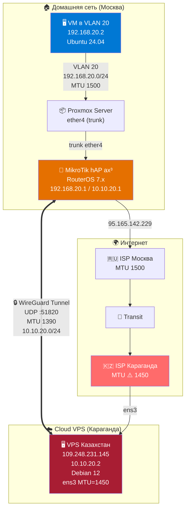
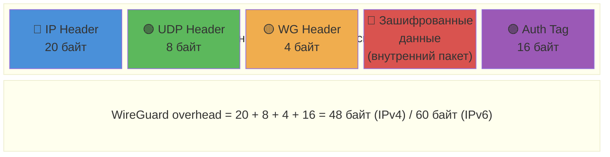
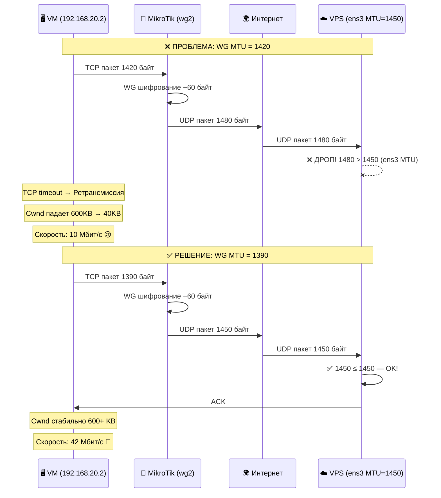
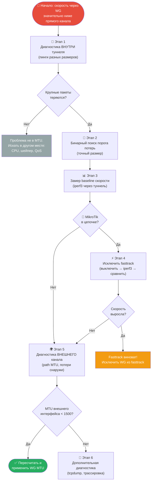
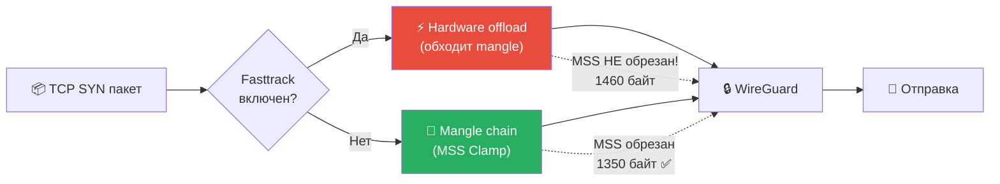
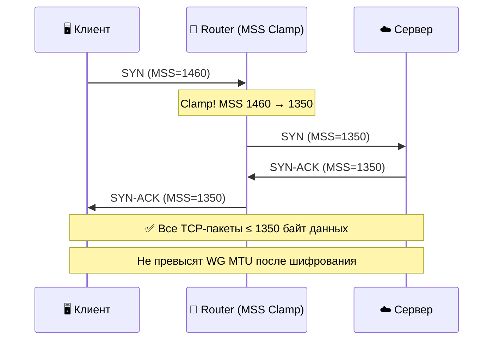

<p align="center">
  
</p>

<h1 align="center">🔧 WireGuard MTU Black Hole — Диагностика и решение</h1>

<p align="center">
  <strong>Пошаговое руководство по диагностике и устранению проблем со скоростью WireGuard,<br>вызванных несоответствием MTU на облачных VPS</strong>
</p>

<p align="center">
  
  
  
  
  
</p>

<p align="center">
  <a href="#-симптомы">Симптомы</a> •
  <a href="#-теория">Теория</a> •
  <a href="#-диагностика">Диагностика</a> •
  <a href="#-решение">Решение</a> •
  <a href="#-результат">Результат</a>
</p>

---

## 📋 Оглавление

- [Описание проблемы](#-описание-проблемы)
- [Симптомы](#-симптомы)
- [Топология сети](#-топология-сети)
- [Теория: как MTU ломает WireGuard](#-теория-как-mtu-ломает-wireguard)
- [Диагностика: пошаговый алгоритм](#-диагностика-пошаговый-алгоритм)
  - [Шаг 1 — Определить MTU внешнего интерфейса VPS](#шаг-1--определить-mtu-внешнего-интерфейса-vps)
  - [Шаг 2 — Тест потерь крупных пакетов внутри туннеля](#шаг-2--тест-потерь-крупных-пакетов-внутри-туннеля)
  - [Шаг 3 — Бинарный поиск порога потерь](#шаг-3--бинарный-поиск-порога-потерь)
  - [Шаг 4 — Замер baseline скорости (iperf3)](#шаг-4--замер-baseline-скорости-iperf3)
  - [Шаг 5 — Исключить fasttrack (MikroTik)](#шаг-5--исключить-fasttrack-mikrotik)
  - [Шаг 6 — Проверить path MTU внешнего канала](#шаг-6--проверить-path-mtu-внешнего-канала)
- [Решение](#-решение)
  - [Формула расчёта MTU](#формула-расчёта-mtu)
  - [Применение фикса](#применение-фикса)
- [Результат](#-результат)
- [MSS Clamping — зачем и как](#-mss-clamping--зачем-и-как)
- [Частые значения MTU у провайдеров](#-частые-значения-mtu-у-провайдеров)
- [Чек-лист при развёртывании нового WG-туннеля](#-чек-лист-при-развёртывании-нового-wg-туннеля)

---

## 📝 Описание проблемы

При настройке WireGuard-туннеля между домашним MikroTik-роутером и облачным VPS скорость через туннель составляла **~10 Мбит/с** при прямой скорости канала **~110 Мбит/с**. Большие ICMP-пакеты (≥1350 байт) через туннель терялись. TCP-соединения страдали от массовых ретрансмиссий.

**Причина:** облачный VPS имел MTU внешнего интерфейса **1450** (вместо стандартных 1500) из-за overlay-сети провайдера (VXLAN/GRE). При стандартном WireGuard MTU 1420 зашифрованные пакеты превышали 1450 байт и дропались.

---

## 🚨 Симптомы

Если вы наблюдаете **любой** из этих признаков — велика вероятность MTU-проблемы:

| Симптом | Описание |
|---------|----------|
| 🐌 **Низкая скорость** | Скорость через туннель в 5–15 раз ниже прямого канала |
| 📦 **Потери крупных пакетов** | `ping -s 1400 <peer>` — 100% потерь, а `ping -s 500 <peer>` — 0% |
| 🔄 **TCP ретрансмиссии** | iperf3 показывает сотни Retr, Cwnd падает до 30–50 KB |
| 📉 **Деградация скорости** | Скорость начинается нормально, затем падает в течение секунд |
| 🔇 **Пинги без DF дропаются** | Даже `ping -s 1372 <peer>` (без флага DF) — 100% потерь |
| 🌊 **Нестабильные потери** | Пакеты ~1350 байт — 100% потерь, ~1370 — 20% (не чёткий порог) |

---

## 🌐 Топология сети



---

## 📖 Теория: как MTU ломает WireGuard

### Что такое MTU

**MTU (Maximum Transmission Unit)** — максимальный размер пакета, который может пройти через сетевой интерфейс без фрагментации.

### Структура WireGuard-пакета



> ⚠️ Также WireGuard добавляет **padding** — выравнивание до 16 байт. Реальный overhead может быть **48–64 байт** для IPv4.

### Что происходит при MTU mismatch



### Почему Path MTU Discovery не спасает

В идеальном мире PMTUD решил бы проблему автоматически: маршрутизатор с меньшим MTU отправляет ICMP "Fragmentation Needed" отправителю, и тот снижает размер пакетов.

Но на практике:
- Многие провайдеры **блокируют ICMP**
- Файрволы на VPS (UFW/iptables) могут **фильтровать** ICMP-ответы
- Отправитель не узнаёт о проблеме → повторяет отправку тем же размером → дроп → ретрансмиссия

---

## 🔍 Диагностика: пошаговый алгоритм

### Общая схема диагностики



### Ключевой принцип: от внутренних тестов к внешним

Диагностика идёт **изнутри наружу**:

1. Сначала проверяем поведение **внутри** WG-туннеля (tunnel IP → tunnel IP)
2. Затем проверяем поведение **транзитного** трафика (клиент за роутером → VPS через туннель)
3. Затем исключаем влияние **промежуточного оборудования** (fasttrack, файрвол)
4. И только потом смотрим на **внешний** канал (public IP → public IP)

Это позволяет быстро локализовать проблему и не тратить время на ненужные тесты.

---

### Этап 1 — Базовая проверка: работает ли туннель вообще?

Прежде чем искать проблему MTU, убедитесь что туннель функционирует:

```bash
# Проверить что WG-интерфейс поднят
wg show

# Проверить наличие handshake (должен быть свежий)
wg show wg0 latest-handshakes
```

Ожидаемый результат — handshake не старше 2–3 минут. Если handshake отсутствует — проблема в подключении WG, а не в MTU.

Далее — контрольный пинг **маленькими пакетами** через туннель:

```bash
# С одного конца туннеля на другой
ping -c 5 10.10.20.1
```

> ⚠️ **Типичная ошибка:** пинг на свой собственный туннельный IP. Если VPS = 10.10.20.2, то `ping 10.10.20.2` с VPS пингует loopback (TTL=64, RTT <0.1ms). Всегда пингуйте **удалённый** конец туннеля!

Ожидаемый вывод (туннель работает):
```
64 bytes from 10.10.20.1: icmp_seq=1 ttl=64 time=104 ms
```

Если маленькие пинги проходят, а скорость низкая — переходим к тестам размера пакетов.

---

### Этап 2 — Тест потерь крупных пакетов внутри туннеля

Это **ключевой диагностический тест**. Отправляем пинги разных размеров через туннель и смотрим, где начинаются потери.

#### 2.1 Грубая проверка (маленький vs большой)

```bash
# Маленький пакет — контрольный
ping -c 5 -s 56 <REMOTE_TUNNEL_IP>

# Средний пакет
ping -c 5 -s 1000 <REMOTE_TUNNEL_IP>

# Большой пакет (близко к MTU)
ping -c 5 -s 1400 <REMOTE_TUNNEL_IP>
```

**Таблица интерпретации:**

| -s 56 | -s 1000 | -s 1400 | Вердикт |
|:---:|:---:|:---:|:---|
| ✅ 0% | ✅ 0% | ✅ 0% | MTU OK, проблема в другом месте |
| ✅ 0% | ✅ 0% | ❌ потери | **MTU проблема** — переходим к бинарному поиску |
| ✅ 0% | ❌ потери | ❌ потери | MTU проблема с низким порогом или серьёзные проблемы канала |
| ❌ потери | ❌ потери | ❌ потери | Проблема канала целиком, не MTU |

#### 2.2 Бинарный поиск точного порога

Когда грубая проверка выявила потери на крупных пакетах — ищем точную границу:

```bash
for s in 1300 1320 1340 1350 1360 1370 1380 1390; do
  echo "=== SIZE $s ==="
  ping -c 5 -s $s <REMOTE_TUNNEL_IP>
done
```

**Как читать результат:**

```
=== SIZE 1340 ===
5 packets transmitted, 5 received, 0% packet loss     ← ✅ OK
=== SIZE 1350 ===
5 packets transmitted, 0 received, 100% packet loss   ← ❌ ПОРОГ!
=== SIZE 1360 ===
5 packets transmitted, 4 received, 20% packet loss    ← ⚠️ Частичные потери
```

> 📌 **Нюанс:** При MTU-проблеме порог может быть **нечётким**. Например, 1350 теряется на 100%, а 1370 — только на 20%. Это нормально и связано с тем, что WireGuard добавляет **padding** (выравнивание до 16 байт), из-за чего внешние размеры пакетов не растут линейно.

#### 2.3 Проверка воспроизводимости

Прогоните тот же набор размеров **повторно**. Если результаты каждый раз разные — возможно проблема не (только) в MTU, а в QoS/rate-limiting у провайдера для крупных UDP-пакетов.

```bash
# Повторный прогон для подтверждения
for s in 1300 1340 1350 1360 1370 1380 1390; do
  echo "=== SIZE $s ==="
  ping -c 5 -s $s <REMOTE_TUNNEL_IP>
done
```

#### 2.4 Тест из-за роутера (транзитный трафик)

Если клиенты находятся за роутером (MikroTik, pfSense и т.д.), важно проверить тот же набор размеров **с клиентского хоста**, а не только с самого роутера. Трафик с клиента проходит дополнительную обработку (fasttrack, NAT, mangle):

```bash
# С клиентской VM/ПК через туннель
ping -c 5 -s 1300 <REMOTE_TUNNEL_IP>
ping -c 5 -s 1350 <REMOTE_TUNNEL_IP>
ping -c 5 -s 1372 <REMOTE_TUNNEL_IP>
```

Если с роутера пакеты проходят, а с клиента — нет, проблема в обработке транзитного трафика на роутере (см. Этап 4: fasttrack).

#### 2.5 Тест с MikroTik (если применимо)

MikroTik имеет свою утилиту ping с параметром size:

```routeros
/ping 10.10.20.2 count=5 size=1300
/ping 10.10.20.2 count=5 size=1400
/ping 10.10.20.2 count=5 size=1420
```

> ⚠️ В MikroTik `size` — это полный размер IP-пакета (включая заголовки), а в Linux `ping -s` — только данные (payload). Учитывайте разницу в 28 байт (20 IP + 8 ICMP).

#### 2.6 Тест в обратном направлении

Проблема может быть **асимметричной** (потери только в одну сторону). Обязательно проверьте обратное направление:

```bash
# С VPS → клиент через туннель
ping -c 5 -s 1300 <CLIENT_TUNNEL_IP>
ping -c 5 -s 1350 <CLIENT_TUNNEL_IP>
ping -c 5 -s 1372 <CLIENT_TUNNEL_IP>
```

---

### Этап 3 — Замер baseline скорости (iperf3)

Пинги показывают потери пакетов, а iperf3 — реальное **влияние на TCP-скорость**. Это baseline, с которым будем сравнивать результат после фикса.

#### 3.1 Установка iperf3

```bash
# Debian/Ubuntu
apt install iperf3

# На MikroTik — встроенный (RouterOS 7.x):
# /tool iperf3 server set enabled=yes
```

#### 3.2 Запуск теста

**На VPS** (сервер):
```bash
iperf3 -s
```

**С клиента** через туннель:
```bash
iperf3 -c <VPS_TUNNEL_IP> -t 10
```

#### 3.3 Чтение результатов iperf3

Пример вывода **с проблемой MTU**:
```
[ ID] Interval           Transfer     Bitrate         Retr  Cwnd
[  5]   0.00-1.00   sec  3.75 MBytes  31.4 Mbits/sec  133    436 KBytes
[  5]   1.00-2.00   sec  2.00 MBytes  16.8 Mbits/sec    2    232 KBytes
...
[  5]   8.00-9.00   sec   640 KBytes  5.24 Mbits/sec    0   42.8 KBytes
[  5]   9.00-10.00  sec  0.00 Bytes   0.00 bits/sec     0   48.1 KBytes
```

**Ключевые метрики:**

| Метрика | Что значит | Здоровое значение | Проблемное значение |
|:---|:---|:---:|:---:|
| **Bitrate** | Скорость передачи | Стабильная, близка к каналу | Падает с каждой секундой |
| **Retr** | TCP-ретрансмиссии | 0 | Десятки-сотни |
| **Cwnd** | Окно перегрузки TCP | Стабильное, 500+ KB | Падает до 30–50 KB |

**Характерный паттерн MTU black hole:** скорость начинается высоко (20–30 Мбит/с), затем **деградирует** до 3–7 Мбит/с за несколько секунд. Cwnd коллапсирует. Ретрансмиссии постоянные.

#### 3.4 Тест в обратном направлении

```bash
# -R = reverse mode (сервер отправляет, клиент принимает)
iperf3 -c <VPS_TUNNEL_IP> -t 10 -R
```

#### 3.5 Не забудьте закрыть iperf3 порт после тестов

```bash
# Если открывали в UFW
ufw delete allow 5201/tcp
```

```routeros
# Если открывали на MikroTik
/tool iperf3 server set enabled=no
```

---

### Этап 4 — Исключить влияние fasttrack (только MikroTik)

> 📌 **Этот этап важен только если в цепочке есть MikroTik RouterOS.** Если у вас чистый Linux на обоих концах — пропускайте.

#### Почему fasttrack может влиять

MikroTik fasttrack с `hw-offload=yes`:
- Передаёт обработку пакетов на аппаратный чип
- **Обходит** цепочки `mangle`, `filter` и часть `nat`
- Это значит что MSS Clamping (`/ip firewall mangle`) **не применяется** к fasttracked соединениям
- TCP-сессии через WG-туннель попадают в fasttrack → MSS не обрезается → полноразмерные пакеты → дропы на MTU



#### 4.1 Тест: выключить fasttrack

```routeros
# Запомнить текущее состояние
/ip firewall filter print where comment="defconf: fasttrack"

# Отключить
/ip firewall filter set [find comment="defconf: fasttrack"] disabled=yes
```

Сразу после — замер iperf3 с клиента:
```bash
iperf3 -c <VPS_TUNNEL_IP> -t 10
```

#### 4.2 Вернуть fasttrack

```routeros
/ip firewall filter set [find comment="defconf: fasttrack"] disabled=no
```

> ⚠️ **Не забудьте вернуть!** Без fasttrack пострадает производительность всей остальной маршрутизации.

#### 4.3 Интерпретация

| Без fasttrack | С fasttrack | Вердикт |
|:---:|:---:|:---|
| **Значительно быстрее** (×3–5) | Медленно | Fasttrack виноват → применить фикс ниже |
| **Примерно так же** | Медленно | Fasttrack не виноват → проблема в MTU, переходим к Этапу 5 |

#### 4.4 Фикс: исключить WG из fasttrack

Если fasttrack оказался виновником — нужно перехватить WG-трафик **до** того как fasttrack его заберёт:

```routeros
# Добавить правила ПЕРЕД fasttrack-правилом
/ip firewall filter add chain=forward action=accept \
    connection-state=established,related in-interface=wg2 \
    place-before=[find comment="defconf: fasttrack"]

/ip firewall filter add chain=forward action=accept \
    connection-state=established,related out-interface=wg2 \
    place-before=[find comment="defconf: fasttrack"]
```

Эти правила перехватят трафик через WG-интерфейс до fasttrack, и он пойдёт обычным путём через mangle (где MSS clamp его обработает).

---

### Этап 5 — Диагностика внешнего канала

Если fasttrack не виноват, а потери крупных пакетов внутри туннеля подтверждены — проблема на **внешнем** канале. Нужно выяснить, какой MTU на физическом пути между точками.

#### 5.1 Проверить MTU интерфейса VPS

```bash
ip link show | grep -E "^[0-9]+:" | grep -v lo
```

Пример:
```
2: ens3: <BROADCAST,MULTICAST,UP,LOWER_UP> mtu 1450 qdisc fq_codel state UP
```

> ⚠️ **Если MTU < 1500** — вы нашли причину. Облачные провайдеры часто используют overlay-сети (VXLAN, GRE, Geneve), которые уменьшают MTU на 50–100 байт.

#### 5.2 Path MTU Discovery вручную

С VPS на удалённый публичный IP (второй конец туннеля):

```bash
# Флаг -M do = установить бит DF (Don't Fragment)
# -s 1472 = payload 1472 + IP 20 + ICMP 8 = 1500 (стандартный MTU)
ping -c 3 -s 1472 -M do <REMOTE_PUBLIC_IP>
```

**Расшифровка ответов:**

| Ответ | Значение |
|:---|:---|
| `local error: message too long, mtu=1450` | MTU **локального** интерфейса = 1450 |
| `Frag needed and DF set (mtu = 1400)` | MTU **промежуточного** узла = 1400 |
| `1480 bytes from ...` | Пакет прошёл, MTU пути ≥ 1500 |

Если первый тест показал ошибку — уменьшаем размер:

```bash
# Пробуем MTU 1450
ping -c 3 -s 1422 -M do <REMOTE_PUBLIC_IP>   # 1422 + 28 = 1450

# Пробуем MTU 1400
ping -c 3 -s 1372 -M do <REMOTE_PUBLIC_IP>   # 1372 + 28 = 1400
```

#### 5.3 Проверка потерь крупных пакетов на внешнем канале

Без DF-флага, но с большим количеством пакетов — покажет реальный процент потерь:

```bash
# 20 пакетов для статистики
ping -c 20 -s 1472 <REMOTE_PUBLIC_IP>   # полноразмерные
ping -c 20 -s 1400 <REMOTE_PUBLIC_IP>   # средние
ping -c 20 -s 500  <REMOTE_PUBLIC_IP>   # маленькие — контрольные
```

Если маленькие идут без потерь, а крупные теряются — проблема MTU подтверждена на уровне физического канала.

#### 5.4 Прямой iperf3 без WireGuard

Этот тест показывает пропускную способность канала **без** WG-шифрования. Позволяет понять, сколько скорости теряется именно на WG overhead.

**На MikroTik:**
```routeros
/tool iperf3 server set enabled=yes
```

**С VPS:**
```bash
iperf3 -c <MIKROTIK_PUBLIC_IP> -t 10
```

**Потом выключить:**
```routeros
/tool iperf3 server set enabled=no
```

> Если и прямой iperf3 показывает ~10 Мбит/с — проблема не в WG, а в пропускной способности маршрута между площадками.

#### 5.5 Traceroute и проверка маршрута

Полезно для понимания, через какие узлы идёт трафик и где может быть бутылочное горлышко:

```bash
# MTR — комбинация ping + traceroute, показывает потери на каждом хопе
mtr -r -c 20 <REMOTE_PUBLIC_IP>

# Обычный traceroute
traceroute -n <REMOTE_PUBLIC_IP>
```

---

### Этап 6 — Дополнительная диагностика (если ничего не помогло)

Если после всех предыдущих этапов проблема не решена:

#### 6.1 tcpdump на VPS — видит ли система пакеты?

```bash
# Слушаем WG-трафик (внешний, зашифрованный)
tcpdump -i ens3 udp port 51820 -c 20 -nn

# Слушаем трафик внутри туннеля
tcpdump -i wg0 icmp -c 20 -nn
```

Если пакеты приходят на ens3 но не появляются на wg0 — проблема в расшифровке (ключи, allowed-ips, WG конфигурация).

#### 6.2 Проверка iptables/nftables

```bash
# Посмотреть счётчики — какие правила срабатывают
iptables -L FORWARD -v -n --line-numbers

# Проверить что MSS clamp на месте и срабатывает
iptables -L FORWARD -v -n | grep TCPMSS
```

Если счётчик TCPMSS не растёт при TCP-трафике — clamp не применяется (правило не в том месте или обходится).

#### 6.3 Проверка sysctl

```bash
# Должно быть 1
cat /proc/sys/net/ipv4/ip_forward

# TCP-параметры
sysctl net.ipv4.tcp_congestion_control
sysctl net.core.rmem_max
sysctl net.core.wmem_max
```

---

## ✅ Решение

### Формула расчёта MTU

```
┌──────────────────────────────────────────────────────────────────┐
│                                                                  │
│   WG_MTU = MIN_PATH_MTU − WG_OVERHEAD                            │
│                                                                  │
│   где:                                                           │
│     MIN_PATH_MTU  = минимальный MTU на внешнем пути              │
│     WG_OVERHEAD   = 60 байт (IPv4) или 80 байт (IPv6)            │
│                                                                  │
│   ────────────────────────────────────────────────────────────   │
│                                                                  │
│   Примеры:                                                       │
│     MTU 1500 → WG_MTU = 1500 - 60 = 1440                         │
│     MTU 1450 → WG_MTU = 1450 - 60 = 1390  ← облачные VPS         │
│     MTU 1400 → WG_MTU = 1400 - 60 = 1340                         │
│                                                                  │
└──────────────────────────────────────────────────────────────────┘
```

> 💡 **WireGuard IPv4 overhead (60 байт):** 20 (внешний IP) + 8 (UDP) + 4 (WG header) + 16 (Auth Tag) + 0–15 (padding до 16 байт). Рекомендуется закладывать 60 байт.

### Применение фикса

#### Linux (wg-quick)

```bash
# Редактировать конфиг
mcedit /etc/wireguard/wg0.conf
```

Изменить строку MTU:
```ini
[Interface]
PrivateKey = <key>
Address = 10.10.20.2/24
MTU = 1390    # ← было 1420, стало 1390
```

Применить:
```bash
wg-quick down wg0 && wg-quick up wg0
```

Проверить:
```bash
ip link show wg0 | grep mtu
# wg0: <POINTOPOINT,NOARP,UP,LOWER_UP> mtu 1390
```

#### MikroTik RouterOS

```routeros
/interface wireguard set [find name=wg2] mtu=1390
```

Проверить:
```routeros
/interface wireguard print where name=wg2
```

#### Другие Linux (без wg-quick)

```bash
ip link set wg0 mtu 1390
```

Для постоянного применения — добавить в systemd-unit или `/etc/network/interfaces`.

---

## 📊 Результат

### До и после

```mermaid
xychart-beta
    title "Скорость через WireGuard-туннель (iperf3, Мбит/с)"
    x-axis ["1с", "2с", "3с", "4с", "5с", "6с", "7с", "8с", "9с", "10с"]
    y-axis "Мбит/с" 0 --> 80
    bar "MTU 1420 (до)" [27, 17, 13, 12, 5, 6, 5, 6, 5, 0]
    bar "MTU 1390 (после)" [28, 38, 37, 43, 43, 43, 44, 49, 43, 49]
```



| Метрика | До (MTU 1420) | После (MTU 1390) | Улучшение |
|---------|:---:|:---:|:---:|
| **Скорость** | 10 Мбит/с | 42 Мбит/с | **×4.2** |
| **Ретрансмиссии** | 144 за 10с | 0 (после разгона) | **×∞** |
| **Cwnd (стабильный)** | 36–80 KB | 570–620 KB | **×8** |
| **Потери крупных ICMP** | 20–100% | 0% | **✅** |

---

## 🔒 MSS Clamping — зачем и как

**MSS (Maximum Segment Size)** — максимальный размер данных в TCP-сегменте. MSS Clamping принудительно уменьшает MSS в SYN-пакетах, чтобы TCP сразу использовал правильный размер.

### Зачем нужен, если MTU уже правильный?

MSS Clamping — это **страховка**:
- PMTUD может не работать (заблокирован ICMP)
- На пути может появиться звено с ещё меньшим MTU
- Стоимость: практически нулевая (срабатывает только на SYN-пакетах)

### Настройка на Linux (iptables)

```bash
# В PostUp секции /etc/wireguard/wg0.conf:
PostUp = iptables -I FORWARD 1 -p tcp --tcp-flags SYN,RST SYN -j TCPMSS --clamp-mss-to-pmtu
PostDown = iptables -D FORWARD -p tcp --tcp-flags SYN,RST SYN -j TCPMSS --clamp-mss-to-pmtu
```

### Настройка на MikroTik

```routeros
/ip firewall mangle add action=change-mss chain=forward \
    comment="Clamp MSS for VPNs" new-mss=clamp-to-pmtu \
    protocol=tcp tcp-flags=syn
```

### Как работает



---

## 🏢 Частые значения MTU у провайдеров

| Провайдер / Тип | MTU | WG MTU (IPv4) | Причина |
|:---|:---:|:---:|:---|
| Обычный Ethernet | 1500 | 1440 | Стандарт |
| **Hetzner Cloud** | 1450 | 1390 | VXLAN overlay |
| **AWS EC2** | 9001 | 8941 | Jumbo frames (в VPC) |
| **GCP** | 1460 | 1400 | GCP внутренняя сеть |
| **DigitalOcean** | 1500 | 1440 | Стандартный |
| **Yandex Cloud** | 1500 | 1440 | Стандартный |
| **VK Cloud** | 1450 | 1390 | VXLAN overlay |
| **Oracle Cloud** | 9000 | 8940 | Jumbo frames |
| **PPPoE (домашний)** | 1492 | 1432 | PPPoE overhead 8 байт |
| **Мобильные 4G/LTE** | 1400–1440 | 1340–1380 | Varies |
| **Некоторые VPS (KZ, СНГ)** | 1450 | 1390 | Overlay сеть |

> ⚠️ **Всегда проверяйте фактический MTU** командой `ip link show` на VPS. Не полагайтесь на документацию провайдера.

---

## ✅ Чек-лист при развёртывании нового WG-туннеля

```
┌─ Перед настройкой WireGuard ───────────────────────────────────────┐
│                                                                    │
│  □  Проверить MTU на ОБОИХ концах: ip link show                    │
│  □  Выбрать минимальный из двух                                    │
│  □  Рассчитать WG MTU: MIN_MTU − 60 (IPv4) или − 80 (IPv6)         │
│  □  Установить MTU в конфигах WG на ОБОИХ пирах                    │
│  □  Настроить MSS Clamping (iptables/mangle)                       │
│                                                                    │
├─ После настройки ──────────────────────────────────────────────────┤
│                                                                    │
│  □  ping -c 5 -s 56 <peer_tunnel_ip>     → 0% потерь               │
│  □  ping -c 5 -s 1300 <peer_tunnel_ip>   → 0% потерь               │
│  □  ping -c 5 -s 1372 <peer_tunnel_ip>   → 0% потерь               │
│  □  iperf3 -c <peer_tunnel_ip> -t 10     → стабильная скорость     │
│  □  Проверить: Retr = 0, Cwnd стабильный                           │
│  □  curl ifconfig.me с клиента           → IP VPS                  │
│                                                                    │
├─ Безопасность ─────────────────────────────────────────────────────┤
│                                                                    │
│  □  Приватные ключи НЕ в git, НЕ в чатах                           │
│  □  Если ключ засветился — ПЕРЕГЕНЕРИРОВАТЬ                        │
│  □  UFW/iptables: открыт только WG-порт + SSH                      │
│  □  iperf3 порт (5201) закрыт после тестов                         │
│                                                                    │
└────────────────────────────────────────────────────────────────────┘
```

---

## 📚 Полезные ссылки

- [WireGuard — официальная документация](https://www.wireguard.com/)
- [MikroTik WireGuard Wiki](https://help.mikrotik.com/docs/spaces/ROS/pages/69664792/WireGuard)
- [Understanding MTU and MSS](https://www.cloudflare.com/learning/network-layer/what-is-mtu/)
- [Path MTU Discovery (RFC 1191)](https://datatracker.ietf.org/doc/html/rfc1191)

---

## 📄 Лицензия

Этот материал распространяется под лицензией [MIT](LICENSE). Используйте свободно.

---

<p align="center">
  <sub>Создано на основе реального кейса диагностики. Москва → Караганда, март 2026.</sub>
</p>
